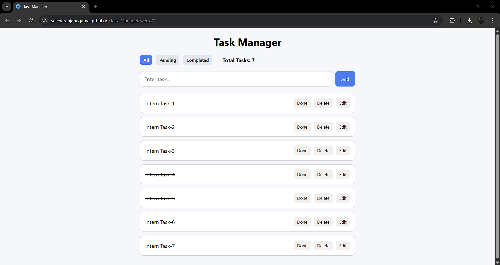

<h1 align="center">📝 React Task Manager App (Week 7 Project)</h1>

<p align="center"> 
   
   
  
   
</p> 

<p align="center">
  A simple and interactive <b>Task Manager Application</b> built as part of my 
  <b>Week 7 Internship Project</b>.  
  It supports full <b>CRUD operations</b> — Create, Read, Update, Delete — with state management using 
  <b>Redux Toolkit</b> and optional persistence using browser <b>LocalStorage</b>.  
  Everything is handled on the client-side with React components and styled-components.
</p>

---

## 🚀 Live Demo  
🔗 **View Project:** [📝 Task Manager App](https://saicharanjanagama.github.io/Task-Manager-week7/)

📸 **Preview:**  
<p align="center">
  
</p>

---

## 🎯 Features

- ➕ Add new tasks dynamically  
- 👀 View all tasks in a clean list  
- ✏️ Edit existing tasks with inline editing  
- 🗑️ Delete tasks with confirmation popup  
- ✅ Mark tasks as completed or pending  
- 🔄 Filter tasks by status: All / Pending / Completed  
- 💾 Optional LocalStorage persistence  
- ⚡ Real-Time UI updates using Redux Toolkit  
- 🧱 Clean UI layout with styled-components  
- 📱 Fully responsive on mobile and desktop

---

## 🛠️ Technologies Used

- **React JS**  
  *(Component-based architecture, hooks, state management)*  
- **Redux Toolkit**  
  *(Centralized state management with slices)*  
- **Styled-Components**  
  *(CSS-in-JS for dynamic styling)*  
- **LocalStorage API**  
  *(Optional persistence of tasks in browser)*  

---

## 🧠 How the App Works

1. User adds a new task using the input field
2. Task is stored in Redux state
3. Task data is synced with LocalStorage
4. User can:
   - ✏️ Edit task
   - ✅ Mark task as completed
   - 🗑️ Delete task
5. Filters allow viewing tasks by status
6. UI updates instantly via Redux store

---

## 📂 Project Structure

Task-Manager-week7/<br>
│── public/<br>
│── src/<br>
│   ├── app/<br>
│   │   └── store.js<br>
│   ├── components/<br>
│   │   ├── Filter.js<br>
│   │   ├── TaskInput.js<br>
│   │   ├── TaskList.js<br>
│   │   └── TaskItem.js<br>
│   ├── features/<br>
│   │   └── task/<br>
│   │       └── taskSlice.js<br>
│   ├── App.css<br>
│   ├── App.js<br>
│   ├── index.css<br>
│   └── index.js<br>
│── README.md

---

## 🚀 How to Run Locally

1. Clone the repository:  
```bash
git clone https://github.com/saicharanjanagama/Intern-Week7.git
cd Intern-Week7
```
2. Install dependencies:
```bash
npm install
```
3. Start the development server:
```bash
npm start
```

---

## 👨‍💻 Author

It’s me — **Sai Charan Janagama** 😄<br>
🎓 Computer Science Graduate | 🌐 Aspiring Full Stack Developer<br>
📧 [Email Me](saic89738@gmail.com) ↗<br>
🔗 [LinkedIn](https://www.linkedin.com/in/saicharanjanagama/) ↗<br>
💻 [GitHub](https://github.com/SaiCharanJanagama) ↗

---

## 💬 Feedback

If you have any feedback or suggestions, feel free to reach out!  
Your input helps me improve 🚀
